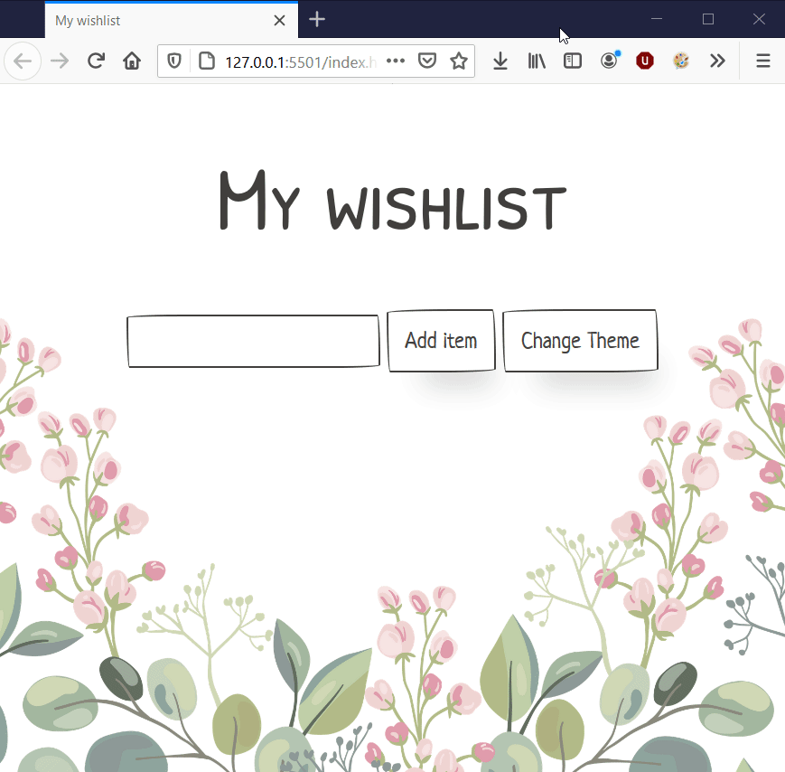

# oe-verlanglijstje-start

## Opgave - basisuitwerking
### Wishlist items toevoegen
Maak een webapplicatie waarin het mogelijk is om een verlanglijst op te stellen.
Gebruikers kunnen een item op hun verlanglijst toevoegen door iets in een inputveld te schrijven,
waarna ze het (na het klikken op een knop) kunnen toevoegen aan een lijst.

### Wishlist items aan- of afvinken
Wanneer een item toegevoegd werd aan de verlanglijst, moet het mogelijk zijn om
het aan te tikken zodat je het kan markeren als gekregen. Het item wordt dan
doorstreept.

Misschien misklikte de gebruiker wel, dus zorg ervoor dat deze actie omgekeerd kan worden.

### Error handling
Zorg ervoor dat, wanneer een gebruiker een leeg item wil toevoegen, er een boodschap wordt getoond dat dit onmogelijk is. Deze melding kan weer weggeklikt worden.

## Opmaak - paper.css
Om snel een goedogende applicatie te maken werd reeds een css-file voorzien.
Deze file, `paper.css` zorgt ervoor dat er onmiddellijk heel wat stijlen toegepast worden
op je HTML-elementen. Voel je vrij om deze al dan niet te koppelen.

## Uitbreiding
Voorzie twee thema's in je applicatie. Het standaardthema toont een achtergrond met bloemen.
Het alternatieve thema is een thema met gras.
De achtergronden vind je in de `img`-map.

## Voorbeeld

